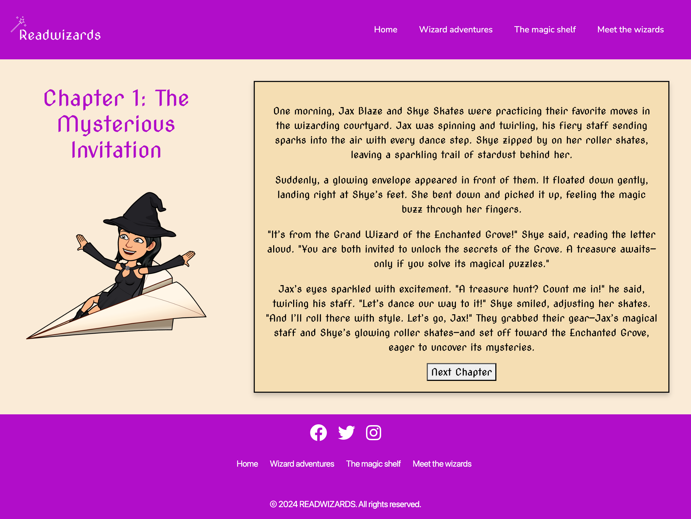

# *READWIZARDS*

Welcome to Readwizards – a magical world where reading and play come together! Our website invites young adventurers to explore exciting stories and fun reading games. You can discover new reading materials and enjoy engaging activities. Join us on an adventure where every page turns into a new discovery. Parents and guardians can also easily reach out to us for support, questions, or book recommendations.

Check out our website at the following [link](https://agui2393.github.io/ReadWizards/)
---

## Table of Contents

1. [Header](#header)
  - [Subheader](#subheader)
2. [Table of Contents](#table-of-contents)
3. [Target Audience](#target-audience)
4. [Visitors Goals](#visitors-goals)
  - [First Time Visitors Goals](#first-time-visitors-goals)
  - [Returning Visitors Goals](#returning-visitors-goals)
  - [Frequent Visitors Goals](#frequent-visitors-goals)
5. [Features](#features)
  - [Navigation bar](#navigation-bar)
  - [Footer](#footer)
6. [Website Pages](#website-pages)
  - [Home Page](#home-page)
  - [Wizard Adventures Page](#wizard-adventures)
  - [The Magic Shelf Page](#the-magic-shelf)
  - [Meet The Wizards](#meet-the-wizards)
7. [Technologies Used](#technologies-used)
8. [Design](#design)
  - [Process](#process)
  - [Color Scheme](#color-scheme)
  - [Typography](#typography)
  - [Wireframes](#wireframes)
9. [Testing](#testing)
10. [Deployment](#deployment)
  - [Deployment to GiHub Pages](#deployment-to-github-pages)
  - [Local Deployment](#local-deployment)
11. [Future Improvements](#future-improvements)
12. [Credits](#credits)
  - [Content](#content)
  - [Media](#media)
13. [Acknowledgments](#acknowledgments)

## Target Audience

The Readwizards website is designed for young readers aged 8 and upwards, as well as their families and educators. Our audience includes children who are beginning to dive into the world of books and storytelling, particularly those who are fans of magical and wizard-themed literature. Parents seeking new and engaging ways to connect their kids with books, and educators looking for creative, fun ways to foster a love for reading, will find Readwizards to be an exciting resource.

Whether they are budding bookworms enchanted by wizardry, parents searching for captivating ways to inspire a love of reading, or teachers in need of imaginative educational tools, Readwizards offers a world of adventure, learning, and fun.

The website’s design is colorful, interactive, and easy to navigate, with a fun wizard theme that will delight young readers and fans of magical stories. With a focus on simplicity and excitement, we provide a seamless experience that encourages curiosity and discovery. Every corner of our site reflects our mission: making reading a magical, enjoyable experience that sparks creativity and builds a lifelong love of books.

## Visitors Goals 

### First Time Visitor Goals:
* As a First Time Visitor, I want to quickly understand the magical world of Readwizards, so I can discover the exciting adventures, stories, and resources available for young readers.

* As a First Time Visitor, I want to easily navigate the website, so I can find interactive activities, book recommendations, and wizard-themed content that will captivate my child’s imagination.
* As a Returning Visitor, I want to connect with Readwizards on social media, so I can engage with the brand, ask questions, and stay in the loop about the latest updates and new features.

### Returning Visitor Goals:
* As a Returning Visitor, I want to see new magical stories, interactive features, and seasonal themes, so I can stay updated on the latest wizard adventures and content.
* As a Returning Visitor, I want to access descriptions of books, games, and educational resources, so I can make informed decisions about which magical stories or activities to explore next.

### Frequent Visitor Goals:
* As a Frequent Visitor, I want to join the Readwizards community on social media, so I can connect with other fans of the site, participate in discussions, and discover new magical content.
* As a Frequent Visitor, I want to easily access the games and activities I enjoy the most, so I can keep having fun and learning with new wizard-themed challenges and adventures.

## Features

+ ### Navigation bar
    - Positioned at the top of the page.
    - Contains navigation links on the right side:
      * Home: Leads to the homepage where visitors can explore the magical world of Readwizards, view images that showcase the excitement of wizard adventures, and learn about the site’s offerings.
      * Wizard Adventures: Leads to the Wizard Adventures page, where users can dive into a collection of magical stories, games, and interactive challenges that will immerse them in the enchanting world of Readwizards.
      * Magic Shelf: Leads to the Magic Shelf page, where users can discover a variety of stories to help young readers explore new worlds.
      * Meet the Wizards: Leads to the Meet the Wizards page, where users can learn about the different characters and wizards that guide them through their magical journey. This page offers details about each wizard’s unique abilities, stories, and adventures, making it easy for visitors to connect with their favorite characters.
    - The links have animated with hover effect.
    - The navigation is clear and easy to understand for the user.

    

    - The navigation bar is responsive:

    * On tablets and phone: navigation bar turns into a hamburger menu.
    * When the hamburger menu is clicked, there is dropdown menu with the links in the same order.

    

+ ### Footer

    - Positioned at the bottom of the page contatins social media icons with links that open in a new webpage. 
    - Links has been added to the different sections of the website to make easier for users to go back to the other sections without having to scroll back to the top of the website.
    - Also copyright notice has been added into the footer area.
    - The links and icons have animated with hover effect.

---

## Website Pages

### Home Page

   - Represent: 
    
   * The homepage introduces visitors to the magical world of Readwizards, with a brief description of the website’s purpose and features. It provides an inviting atmosphere for young readers and families to explore stories, games, and educational activities.
   * The page offers easy to understand text about the site’s mission, emphasizing the fun, interactive experiences that await.
   * An eye catching Play Now button is displayed, allowing visitors to immediately dive into the adventure by clicking the link to start playing games.
    

   

---

### Wizard adventures Page
    
* The Wizard Adventures page invites visitors to embark on magical quests with two exciting challenges. Each challenge offers a unique adventure, where young readers can play as a wizard and face fun and interactive tasks.
* Each challenge box has the name of the challengue and description.
* Inside each challengue box a Play button is prominently displayed, each leading to a different game challenge. These games are designed to encourage children to read while playing, all within a wizard-themed world.
* The page is visually rich, featuring images of the characters that players will encounter throughout their adventures. These images bring the magical world to life, making the page visually appealing and exciting for young readers.

---

#### The Enchanted Question: Solve the Spell Page
    
* The page starts with a header that includes a challenge Title and subheader with  instructions to engage users and explain the objective of the challenge.
* The main body of the page (on the left) features a story that immerses users in the magical world, setting the stage for the challenge.
* On the right side of the page, a picture of a character from the adventure is displayed. The character image features a floating animation created using CSS keyframes. This feature enhances the interactive experience and makes the page feel dynamic and alive.
* A "Begin Quest" button is placed at the end of the story to allow readers to start the game once they are ready. Clicking the button triggers the startGame() function, beginning the game and guiding users into the magical adventure.

##### Quest 1 Page

*  Once the function startGame() function is triggered. The story text and character image disappear, transitioning smoothly to the game content.
*  Question box appears on the left side of the screen, presenting the first challenge.
* In the center of the page, three answer boxes are displayed, each containing a different possible answer to the question. The answer boxes are animated with hover effects, making them interactive and visually engaging for the player.
* A countdown timer is displayed, counting down the time the player has to choose an answer. f the timer runs out with no selection, a "Time Out" message will appear, notifying the player that time has expired.
* If the player selects the correct answer, a positive feedback message will appear, confirming the choice and rewarding the player.
* If the player selects an incorrect answer, an incorrect feedback message will appear, gently informing them that the answer is wrong.
* After the feedback message (whether correct or incorrect), a "Next Question" button appears below the feedback message.
* The game consists of 3 questions in total. Players must answer all three to complete the challenge.
* Once the player answers all three questions, a "Game Over" message will appear on the screen.
* Below the "Game Over" message, the player will see their final score, which is based on the number of correct answers.
* If the player answers all three questions correctly, their score will be 3, and a "Go to the next quest" button will appear, allowing them to proceed to the next challenge.
* If the player's score is lower than 3, a "Try Again" button will appear, inviting them to replay the challenge in order to improve their score.

#### Jax’s Magical Quest: Finding the Wizard Name Page 

* The page starts with a header that includes a challenge Title and subheader with  instructions to engage users and explain the objective of the challenge.
* The main body of the page (on the left) features a story that immerses users in the magical world, setting the stage for the challenge.
* On the right side of the page, a picture of a character from the adventure is displayed. The character image features a floating animation created using CSS keyframes. This feature enhances the interactive experience and makes the page feel dynamic and alive.
* A "Begin Quest" button is placed at the end of the story to allow readers to start the game once they are ready. Clicking the button triggers the startGame() function, beginning the game and guiding users into the magical adventure.

##### Quest 2 Page

* This page offers an interactive experience where users can receive a unique wizard name based on their input.
* Once the function startGame() function is triggered. The story text and character image disappear, transitioning smoothly to the game content.
* Name Input Box: The user is prompted to enter their name in a text input box. The name is a required field, and if left blank, an error message will appear, guiding the user to fill it in before proceeding.
* Gender Selection: Users can choose their gender using a radial button, with options for "Boy" or "Girl." This helps personalize the wizard name by tailoring it to the user’s selection.
* Submit Button: Once the user has filled in their name and selected their gender, they can click the submit button to generate their wizard name.
* Random Wizard Name Generator: Upon submission, the page will interact with an API to pull a random wizard name based on the input and selection. The generated wizard name will be displayed to the user as a fun and personalized result.
* Once finish the user has the option to try again by clicking on "Play again" button.

---

### The Magic Shelf Page

* The Magic Shelf page offers an immersive reading experience, where users can enjoy chapters of an ongoing story, navigating through them with ease.
* Each chapter is displayed clearly on the page, offering a smooth and engaging reading experience. The content is laid out to keep the reader immersed in the story, with no distractions.
* After finishing a chapter, users can click the "Next Chapter" button to move on to the following part of the story. This button is easily accessible at the bottom of the chapter, encouraging seamless navigation through the narrative.
* Once the user reaches the final chapter, the page provides a "Return to First Chapter" button. This allows users to go back to the beginning of the story and start fresh if they wish, making the experience loopable and easy to revisit.

---

### Meet the Wizards Page

* The Meet the Wizards page introduces visitors to the key wizards of the Readwizards universe, providing an in-depth look at each magical character.
* The page features two distinct pictures, one for each wizard, giving users a visual introduction to these magical figures. The images help bring the wizards to life and offer a glimpse of their personalities and magical prowess.
* Below each image, detailed information about the wizard is provided, including their background, abilities, and key traits. This section allows visitors to learn more about the characters, their role in the story, and what makes them unique within the Readwizards world.

---

## Technologies Used

- [HTML](https://developer.mozilla.org/en-US/docs/Web/HTML) was used as core structure of the site.
- [CSS](https://developer.mozilla.org/en-US/docs/Web/css) was applied to style and arrange the layout of the website.
- [CSS Flexbox](https://developer.mozilla.org/en-US/docs/Learn/CSS/CSS_layout/Flexbox) - was used to position elements symmetrically across the pages.
- [JS](https://www.javascript.com/) JavaScript was used to add interactivity and dynamic behavior to the website.
- [APIs]( https://hp-api.onrender.com/api/characters) used to fetch character names from the Harry Potter films for Quest 2, providing the user with a unique wizard name.
- [Miro](https://miro.com/) was used to create the flowchart of the website. 
- [Figma](https://www.figma.com/) was used to make wireframes for the website.
- [VSCode](https://code.visualstudio.com/) served as the primary code editor for writing and modifying the website's code.
- [Git](https://git-scm.com/) was used for the version control of the website.
- [GitHub](https://github.com/) was used to host the code of the website.
- [Bootstrap](https://getbootstrap.com/docs/5.3/getting-started/introduction/) was used to style the links on the footer.

---

## Design

### Process

The development of the Readwizards website began with brainstorming and research focused on creating a fun, interactive platform for young readers. I explored various children’s educational and entertainment sites to gather ideas, paying attention to their design, layout, and interactive features. This research helped me identify key elements to make Readwizards visually appealing and easy to navigate.

The website was designed with a colorful, magical theme that invites users to engage with stories and games. I used HTML and CSS to structure and style the pages, ensuring a clean, responsive layout using CSS Flexbox. Key animations, like floating images of wizard characters, were achieved with CSS keyframes, enhancing the whimsical feel.

To make the site interactive, I incorporated JavaScript for the games and challenges. JavaScript powers real-time features like question and answer games, timers, and score tracking. For example, on the Quest Challenge pages, users can select answers and receive immediate feedback, making the experience more dynamic and engaging.

Testing was a crucial part of the development process. I conducted usability testing with children and parents to refine the user experience. Feedback was also gathered from my mentor, helping to improve site navigation and ensure the interactive elements worked smoothly.

The final result is a magical, user-friendly website where children can explore stories, play games, and embark on wizardly quests, all powered by JavaScript for interactivity and CSS for stunning visual effects.

### Color Scheme

The Readwizards website uses a vibrant and bold color palette to create an engaging, modern, and dynamic experience for visitors.

#6610F2 (Vibrant Purple) is the primary color used throughout the site to evoke creativity, innovation, and a sense of energy. It highlights key design elements and adds a touch of excitement to the brand’s identity, making it stand out.

#9B0DA8 (Deep Purple) is used for accents and calls to action, reinforcing the brand’s bold, distinctive personality. It brings a sense of sophistication and depth, encouraging visitors to explore and interact with the content.

#B10DC9 (Bright Magenta) complements the purple tones and adds a playful, yet professional vibe. It’s used sparingly to draw attention to important elements, such as buttons or links, without overwhelming the design.

#276D26 (Forest Green) adds a natural, grounded touch to the overall palette. This color conveys balance, growth, and trust, and it is used strategically to promote a sense of stability and harmony.

#874AE9 (Soft Purple) acts as a secondary accent, softening the boldness of the primary purples. It adds warmth and highlights subtle details, contributing to the overall flow of the design while maintaining a fresh and approachable look.

Together, these colors create a harmonious balance of boldness and approachability, while staying true to the Readwizards brand’s modern, professional, and creative ethos.

### Typography

- The Nova Cut font was selected to give the Readwizards brand a bold, modern, and dynamic look. Its clean lines and strong presence highlight key elements, like the logo, and help reinforce the brand’s personality, making it easy for visitors to connect and engage with the content.

### Wireframes

- The wireframe for the Readwizards website was created to outline the structure and design of key pages before development. It provides a visual guide to the layout, navigation, and UI components, helping ensure a clear and intuitive user experience.

- You can view and download the wireframe in PDF format from the link below:

  - [Wireframe PDF](documentation/wireframe.pdf)

- Acting as a blueprint for the website, the wireframe helped shape the overall user experience (UX) and keep the design aligned with our goals and your needs. Since the wireframe was first created, I have made several updates to improve the experience, including the addition of bottom links to enhance navigation across the site.

---

## Testing

Please refer to the [TESTING.md](TESTING.md) file for all test-related documentation.

---

## Deployment

### Deployment to GitHub Pages

- The site was deployed to GitHub pages. The steps to deploy are as follows: 

  - In the [GitHub repository](https://github.com/agui2393/ReadWizards.git), navigate to the Settings tab 
  - From the source section drop-down menu, select the **Main** Branch, then click "Save".
  - The page will be automatically refreshed with a detailed ribbon display to indicate the successful deployment.

The live link can be found [here](https://agui2393.github.io/ReadWizards/)

### Local Deployment

In order to make a local copy of this project, you can clone it.
In your IDE Terminal, type the following command to clone my repository:

- `gh repo clone agui2393/ReadWizards`

---

## Future Improvements

- Custom 404 Page: Design a unique 404 error page to improve user experience when they encounter a broken link or incorrect URL. 
- Build the entire website in a single HTML file, simplifying the structure and potentially improving loading times. This will allow for quicker navigation while still maintaining a clean and responsive design.
- Consolidate all JavaScript functionality into one optimized file. This will help reduce load times and improve the maintainability of the site by minimizing the number of external scripts that need to be loaded.
- Further enhance website performance by reducing the file sizes of images without compromising quality.
- Add more interactive elements such as animations, hover effects, and smooth transitions to make the browsing experience more engaging. 

---

## Credits

### Content

- This project drew inspiration from various children's websites, including ClassDojo, to help guide the color scheme and layout design. Their user-friendly interfaces and vibrant, engaging visuals served as a great reference in creating an accessible and fun experience for young users.
-  Also drew inspiration from the YouTube channel 'WEB CIFAR,' and helped me incorporating elements of their JavaScript tutorials to create a timer for the game.

- Inspiration from Level 5 course in Web Application Development on Code Institute that has realle help me to unsderstand how to create a website using CSS, HTML and JS.

### Media

- Images taken from [Unsplash](https://unsplash.com/)

  - [1st image](https://unsplash.com/es/fotos/un-fondo-verde-con-mucho-humo-e2XS7txnZps)
This image was edited with photo editor to change the colour to give it a different look on each HTML page. 

- Images taken from [Bitmoji](https://www.bitmoji.com)
  - All the characters pictures on the website were made using Bitmoji website and each character was created to suit the needs of my website.

- Logo images created with  [Logo](https://logo.com/)
  
  - [Logo 1](/assets/images/logo-color.png)
  - [Logo 2](assets/images/honeydrew-high-resolution-logo-grayscale-transparent.png)

---

## Acknowledgments

- [Lazaros Pilafas](https://github.com/LozPilafas), my husband and coding partner, for his incredible support throughout this project. Lazaros assisted me in implementing CSS, HTML, JS and testing, offering valuable guidance and helping to ensure the quality of the code. Beyond his technical contributions, he kept me calm and focused during the more challenging moments. I’m deeply grateful for his patience, collaboration, and constant encouragement.

- [Julia Konovalova](https://github.com/IuliiaKonovalova), my Code Institute mentor helped me a lot with introducing me to new tools, giving me feedback about my website and helping me testing it.

- [Code Institute](https://codeinstitute.net/) tutors and Slack community members for their support and help.

- [Mario & Oscar]() A special thanks to Mario and Oscar, two talented and curious kids who helped test the website. They used their tech enthusiast and sharp eye for detail, providing me with invaluable feedback that helped shape the user experience. Their input made a real difference!

---