# TESTING

## Compatibility

In order to confirm the correct functionality, responsiveness, and appearance:

+ The website was tested on the following browsers: Chrome, Firefox, Safari.

  - Chrome:

    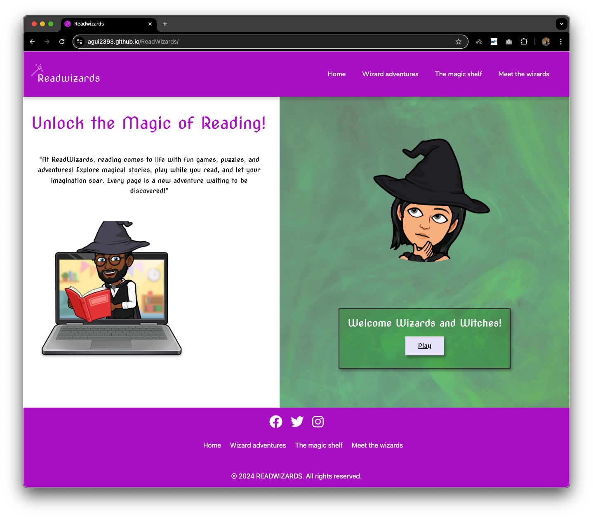

  - FireFox:

    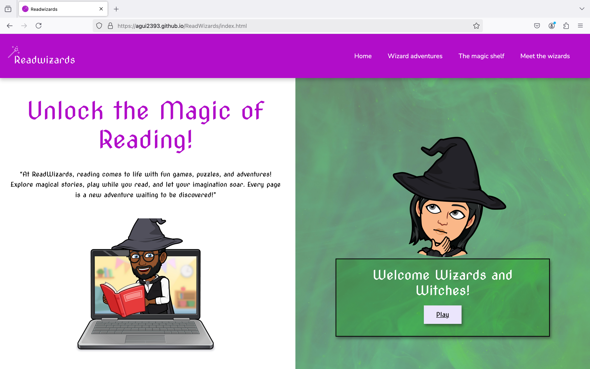

  - Safari:

    
---

## Responsiveness

+ The website was checked by devtools implemented in Firefox and Chrome browsers.

    - Home Page:

    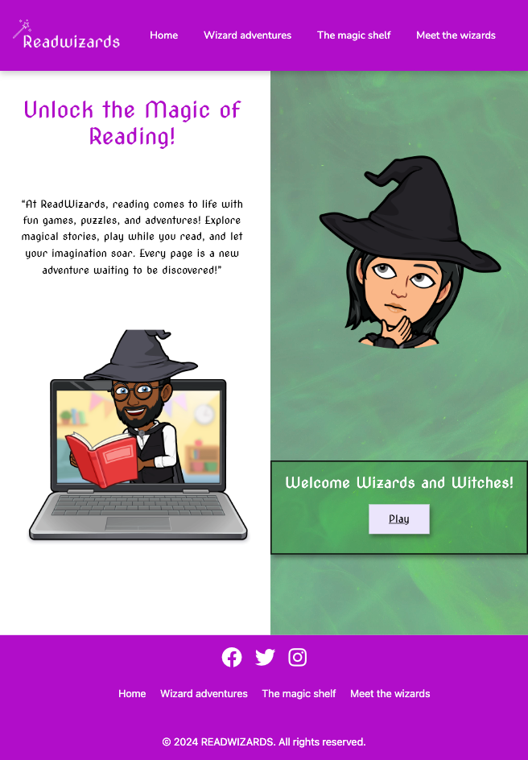

    - Wizard Adventures:

    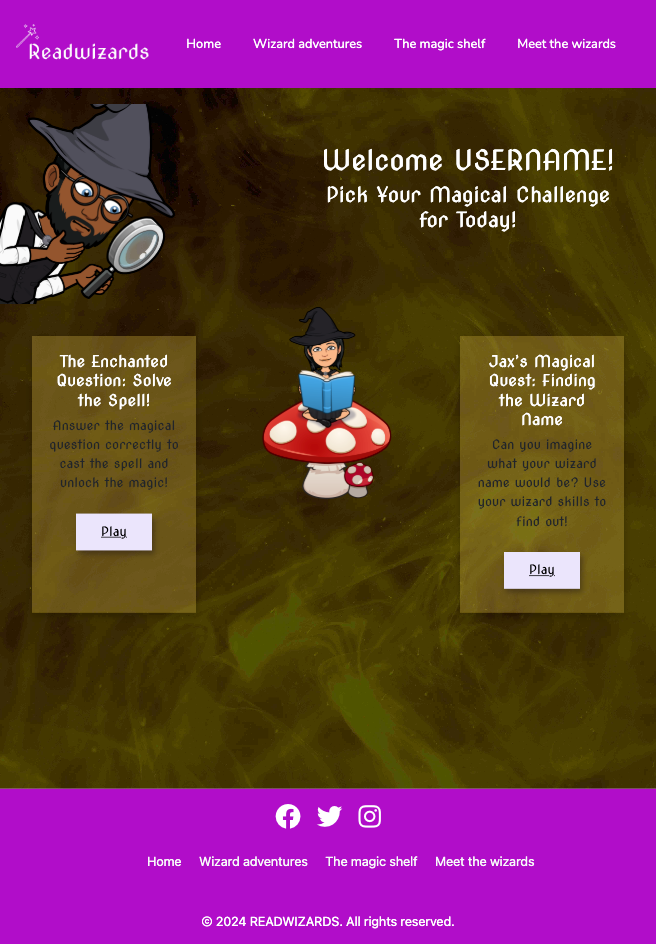

    - Quest 1 text:

    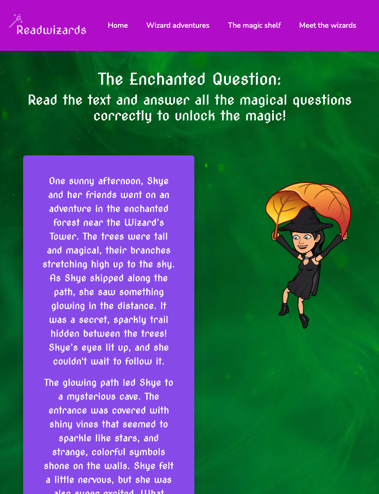

    - Quest 1 game:

    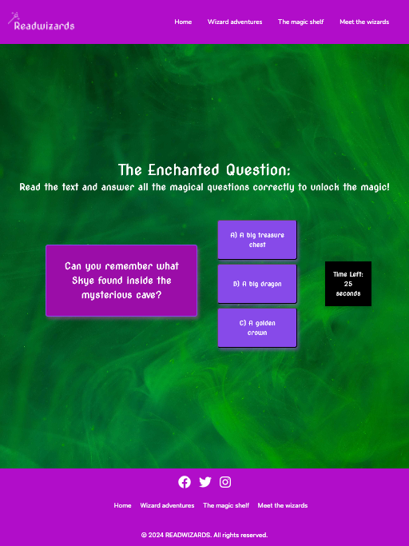

    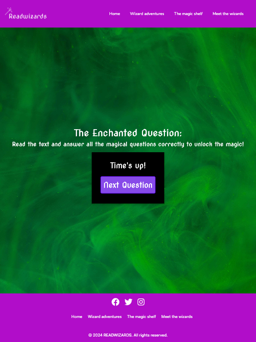

    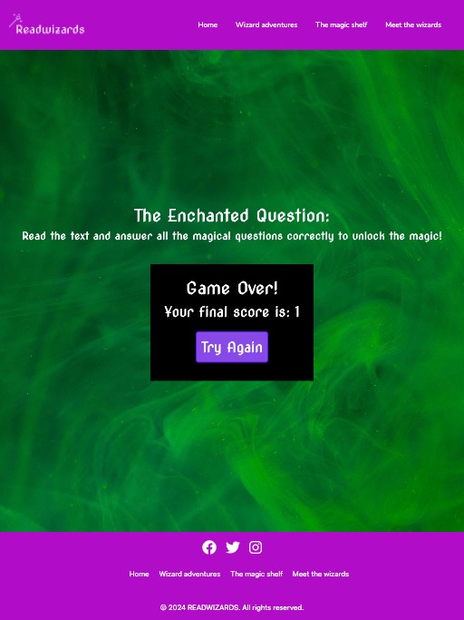

    - Quest 2 text:

    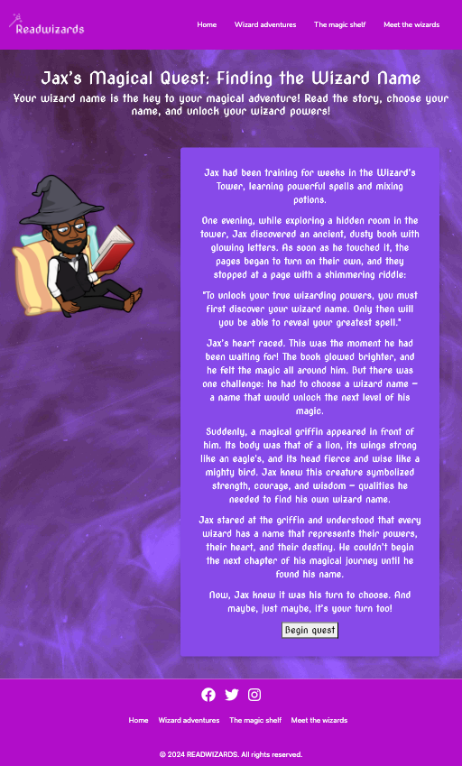

    - Quest 2 game:

    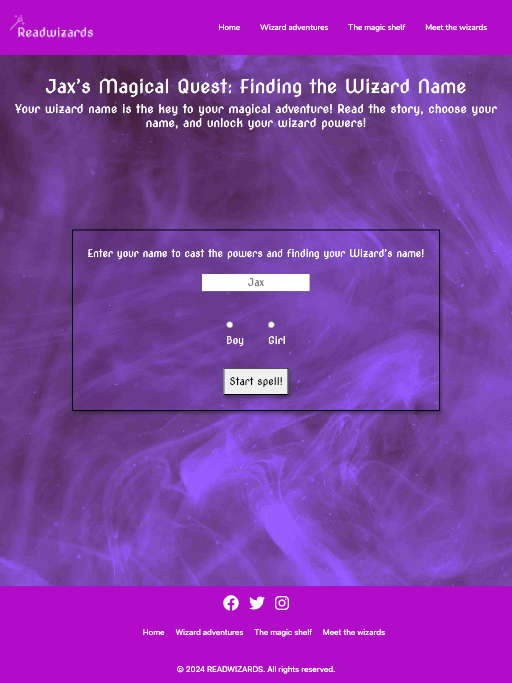
    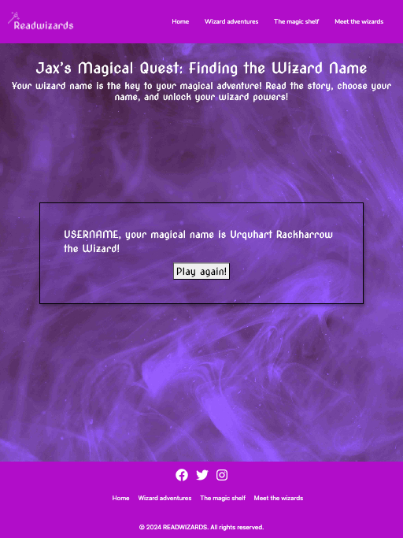

    - Magic Shelf:

    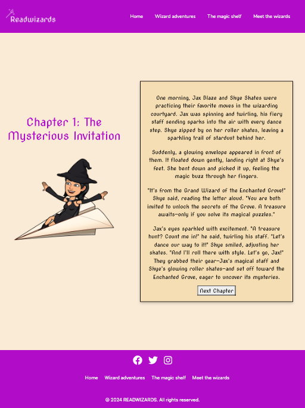

    - Meet the Wizards:

    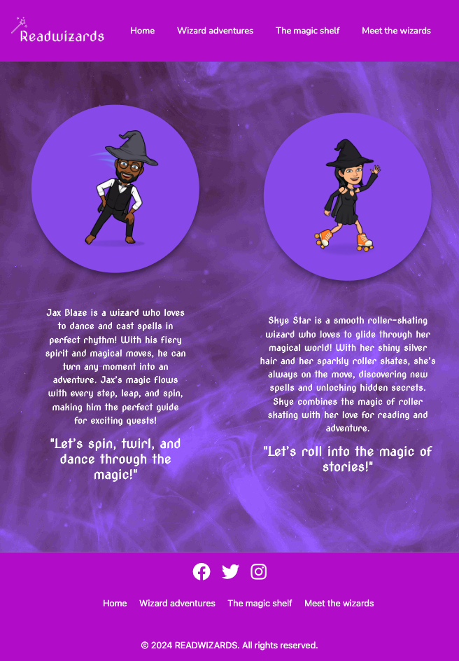

+ The website was also tested for responsiveness on mobilephone devices size with [Responsive Website Design Tester](https://responsivedesignchecker.com/).

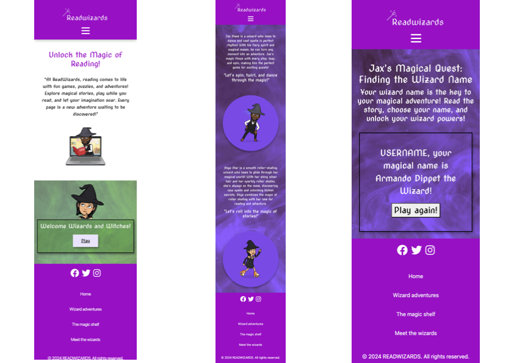
---

## Manual testing

+ The functionality of the links in the website was checked as well by different users. Please, see table below for testing results:

| Feature | Action | Expected result | Tested | Passed | Comments |
| --- | --- | --- | --- | --- | --- |
| Navbar | | | | | |
| Home | Click on the "Home" link | The user is redirected to the main page | Yes | Yes | - |
| Wizard Adventures | Click on the "Wizard Adventures" link | The user is redirected to the Wizard Adventures page | Yes | Yes | - |
| The magic shelf | Click on "The magic shelf" link | The user is redirected to The magic shelf page | Yes | Yes | - |
| Meet the wizards | Click on "Meet the wizards" link | The user is redirected to Meet the wizards page | Yes | Yes | - |
| Footer | | | | | |
| Home | Click on the "Home" link | The user is redirected to the main page | Yes | Yes | - |
| Wizard Adventures | Click on the "Wizard Adventures" link | The user is redirected to the Wizard Adventures page | Yes | Yes | - |
| The magic shelf | Click on "The magic shelf" link | The user is redirected to The magic shelf page | Yes | Yes | - |
| Meet the wizards | Click on "Meet the wizards" link | The user is redirected to Meet the wizards page | Yes | Yes | - |
| Instagram icon in the footer | Click on the Instagram icon | The user is redirected to the Instagram page | Yes | Yes | - |
| Facebook icon in the footer | Click on the Facebook icon | The user is redirected to the Facebook page | Yes | Yes | - |
| Twitter icon in the footer | Click on the Twitter icon | The user is redirected to the Twitter page | Yes | Yes | - |
| Home page | | | | | |
| "Play" button | Click on the "Play" button | The user is redirected to the Wizard adventures page | Yes | Yes | - |
| Wizard adventures | | | | | |
| "Play" button | Click on the "Play" button | The user is redirected to the Quest 1 page | Yes | Yes | - |
| "Play" button | Click on the "Play" button | The user is redirected to the Quest 2 page | Yes | Yes | - |
| Quest 1 page | | | | | |
| "Begin quest" button | Click on the "Begin quest" button | Trigger the start game fuction and game will start | Yes | Yes | - |
| Quest 2 page | | | | | |
| "Begin quest" button | Click on the "Begin quest" button | Trigger the funtion and hides text and shows box | Yes | Yes | - |
| Input box | Enter name | Name entered | Yes | Yes | If user doesn't enter the name, the error message appears |
| "Start spell" button | Click on the "Start spell" button | Trigger the funtion start game and will return a wizard name | Yes | Yes | - |
| "Play again" button | Click on the "Play again" button | Will return you to the begining of the game| Yes | Yes | - |
| The magic shelf | | | | | |
| "Next Chapter" button | Click on the "Next Chapter" button | Trigger the start game fuction and game will start | Yes | Yes | - |
| "Go back to chapter one" button | Click on the "Go back to chapter one" button | Takes you back to first chapter| Yes | Yes | - |

## Validator testing

+ ### HTML

- Home Page

  - No errors or warnings were found when passing through the official W3C validator.

    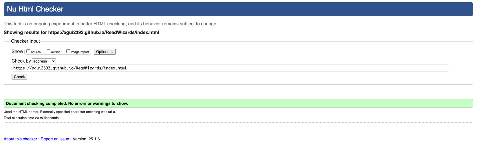

- Wizard adventures Page

  - No errors or warnings were found when passing through the official W3C validator.

    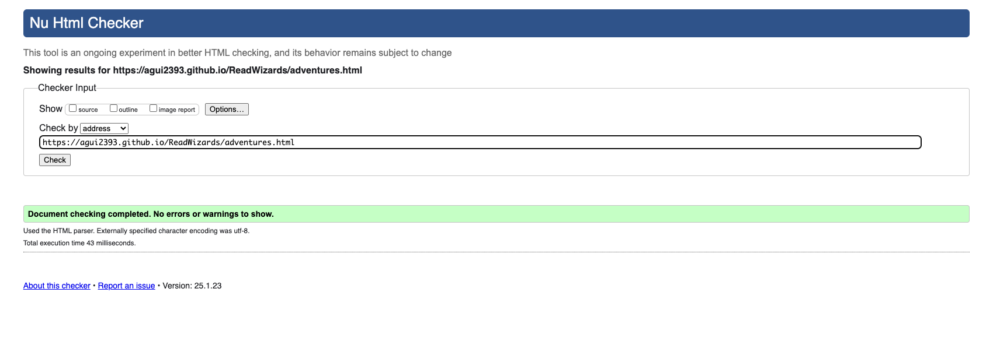

- Quest 1 Page

  - No errors or warnings were found when passing through the official W3C validator.

    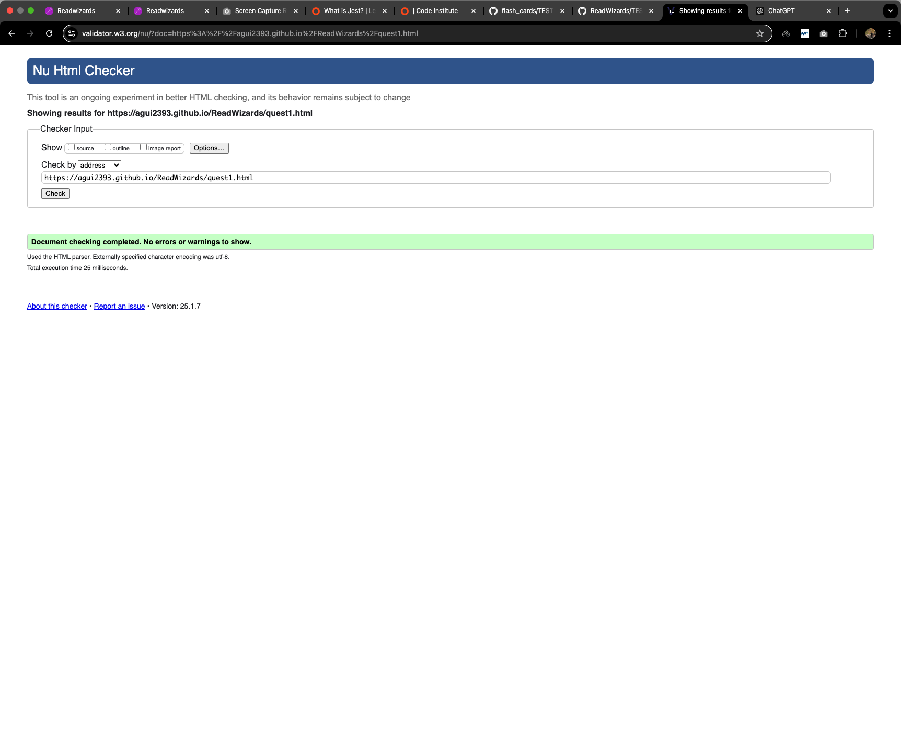

- Quest 2 Page

  - No errors or warnings were found when passing through the official W3C validator.

    

- Magic Shelf Page

  - No errors or warnings were found when passing through the official W3C validator.

    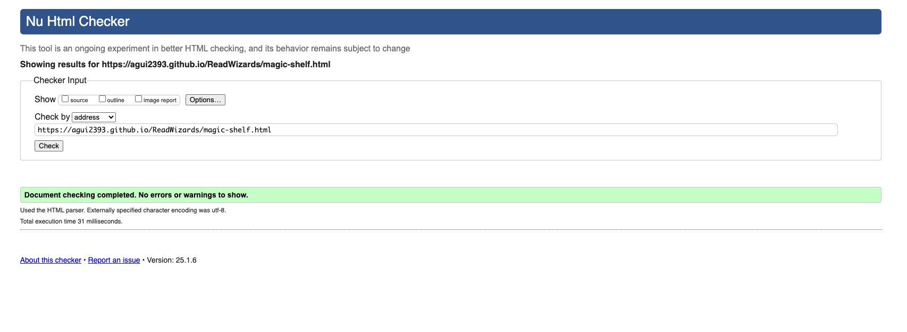

- Meet Wizards Page

  - No errors or warnings were found when passing through the official W3C validator.

    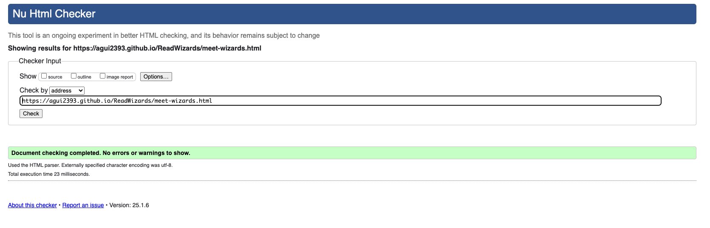

+ ### CSS
  No errors or warnings were found when passing through the official W3C validator.

  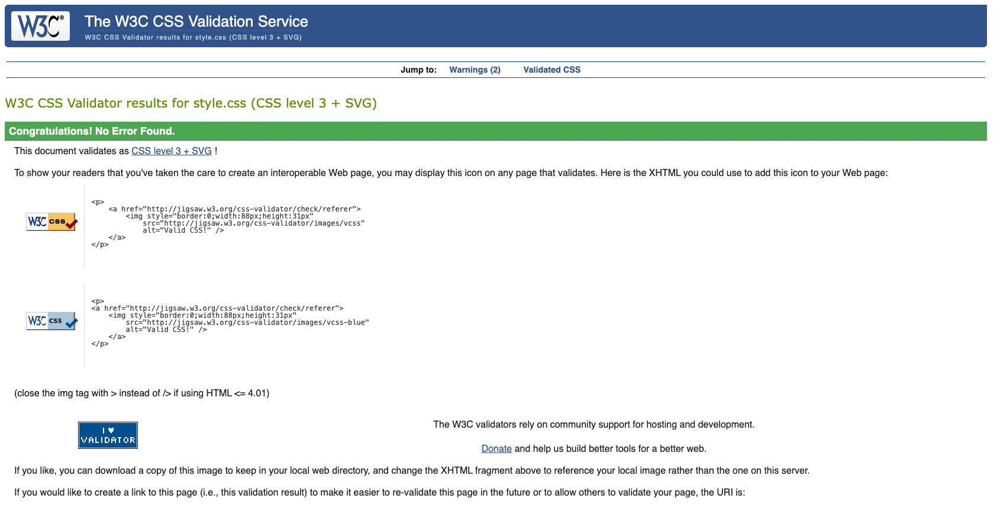

+ ### LightHouse report

- After conducting a thorough Lighthouse audit using DevTools, I’m happy to report that Readwizards meets accessibility standards, and the selected colors and fonts are legible and user-friendly. However, there is a performance bottleneck primarily caused by large image files which can affect page load times. To improve performance, I’ll be optimizing the website by compressing images and implementing responsive image techniques 

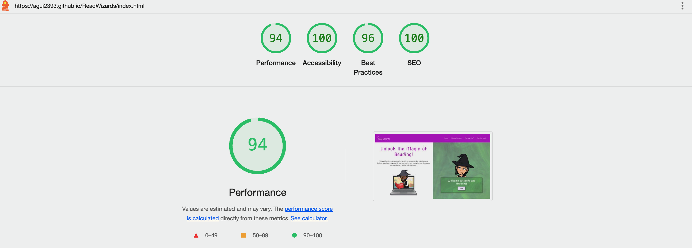

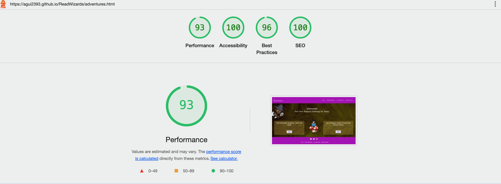

  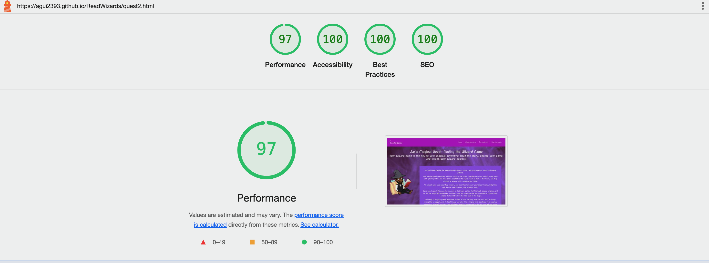

  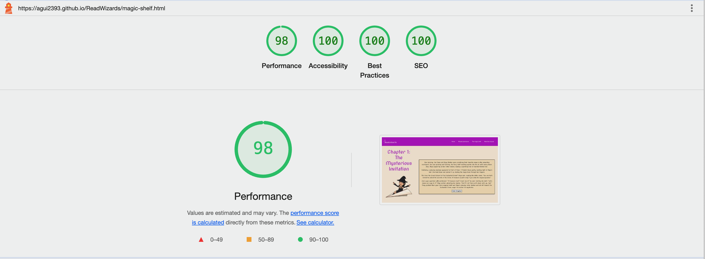

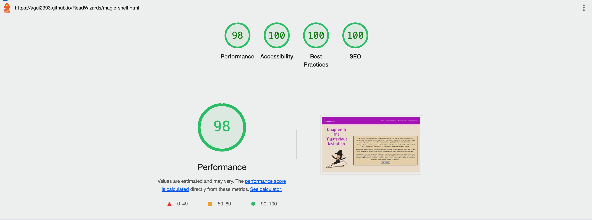

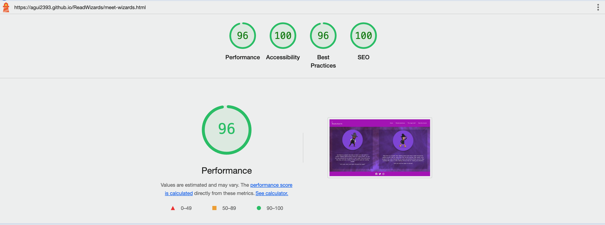

## JS
- No errors were found when testing the code with JSHint. Some warnings appear due to the use of keywords that are part of ECMAScript 6 (ES6), which JSHint does not recognize by default. These warnings are not critical and do not affect the functionality of the code.

- Index:

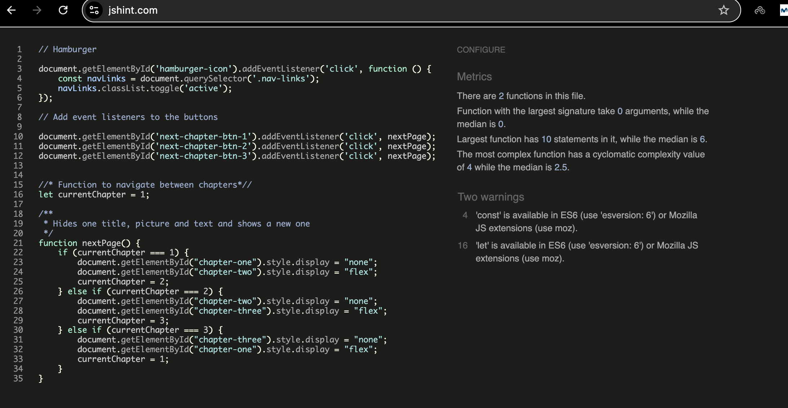

- Text 1:

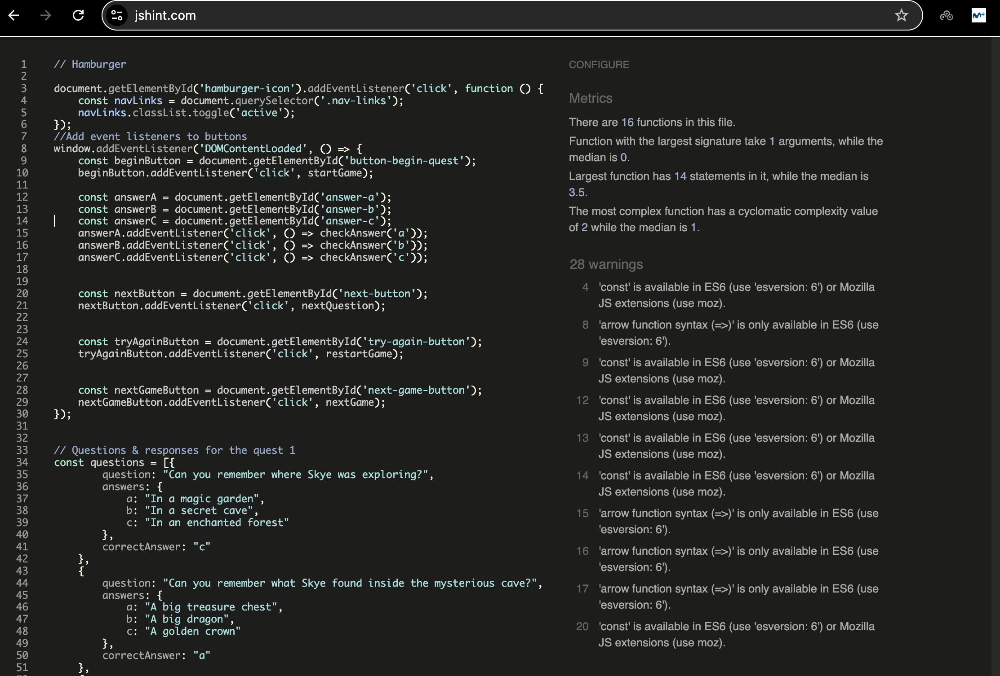

- Text 2:

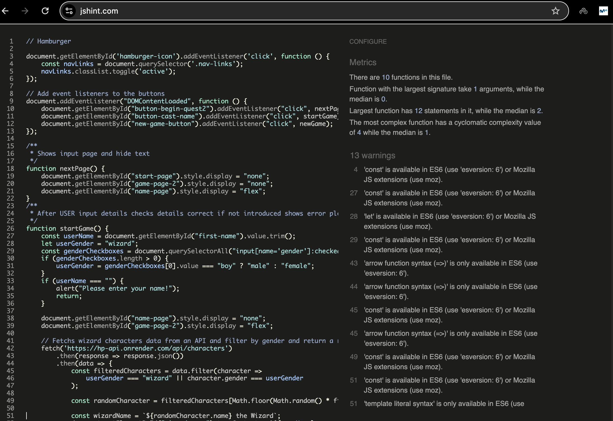

## Bugs

+ ### Solved bugs

- The timer was not stopping after the game finished and continued to show "Time’s Up" after 30 seconds. To resolve this, I added a function that halts the timer after the final question is completed, ensuring the timer behaves correctly throughout the game.

- The API was returning random names instead of names filtered by gender. I’ve updated the API integration by adding a filter to allow names to be fetched specifically by gender, providing a more tailored experience.
