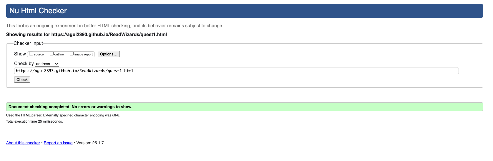
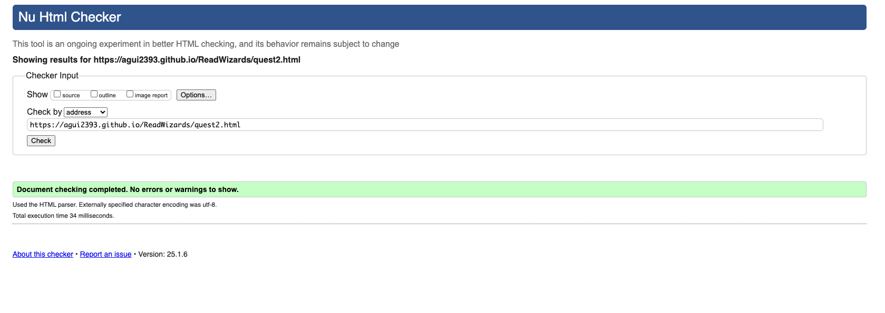

# TESTING

## Compatibility

In order to confirm the correct functionality, responsiveness, and appearance:

+ The website was tested on the following browsers: Chrome, Firefox, Safari.

  - Chrome:

    

  - FireFox:

    

  - Safari:

    
---

## Responsiveness

+ The website was checked by devtools implemented in Firefox and Chrome browsers.

    - Home Page:

    

    - Wizard Adventures:

    

    - Quest 1 text:

    

    - Quest 1 game:

    

    

    

    - Quest 2 text:

    

    - Quest 2 game:

    
    

    - Magic Shelf:

    

    - Meet the Wizards:

    

+ The website was also tested for responsiveness on mobilephone devices size with [Responsive Website Design Tester](https://responsivedesignchecker.com/).

---

## Manual testing

+ The functionality of the links in the website was checked as well by different users. Please, see table below for testing results:

| Feature | Action | Expected result | Tested | Passed | Comments |
| --- | --- | --- | --- | --- | --- |
| Navbar | | | | | |
| Home | Click on the "Home" link | The user is redirected to the main page | Yes | Yes | - |
| Wizard Adventures | Click on the "Wizard Adventures" link | The user is redirected to the Wizard Adventures page | Yes | Yes | - |
| The magic shelf | Click on "The magic shelf" link | The user is redirected to The magic shelf page | Yes | Yes | - |
| Meet the wizards | Click on "Meet the wizards" link | The user is redirected to Meet the wizards page | Yes | Yes | - |
| Footer | | | | | |
| Home | Click on the "Home" link | The user is redirected to the main page | Yes | Yes | - |
| Wizard Adventures | Click on the "Wizard Adventures" link | The user is redirected to the Wizard Adventures page | Yes | Yes | - |
| The magic shelf | Click on "The magic shelf" link | The user is redirected to The magic shelf page | Yes | Yes | - |
| Meet the wizards | Click on "Meet the wizards" link | The user is redirected to Meet the wizards page | Yes | Yes | - |
| Instagram icon in the footer | Click on the Instagram icon | The user is redirected to the Instagram page | Yes | Yes | - |
| Facebook icon in the footer | Click on the Facebook icon | The user is redirected to the Facebook page | Yes | Yes | - |
| Twitter icon in the footer | Click on the Twitter icon | The user is redirected to the Twitter page | Yes | Yes | - |
| Home page | | | | | |
| "Play" button | Click on the "Play" button | The user is redirected to the Wizard adventures page | Yes | Yes | - |
| Wizard adventures | | | | | |
| "Play" button | Click on the "Play" button | The user is redirected to the Quest 1 page | Yes | Yes | - |
| "Play" button | Click on the "Play" button | The user is redirected to the Quest 2 page | Yes | Yes | - |
| Quest 1 page | | | | | |
| "Begin quest" button | Click on the "Begin quest" button | Trigger the start game fuction and game will start | Yes | Yes | - |
| Quest 2 page | | | | | |
| "Begin quest" button | Click on the "Begin quest" button | Trigger the funtion and hides text and shows box | Yes | Yes | - |
| Input box | Enter name | Name entered | Yes | Yes | If user doesn't enter the name, the error message appears |
| "Start spell" button | Click on the "Start spell" button | Trigger the funtion start game and will return a wizard name | Yes | Yes | - |
| "Play again" button | Click on the "Play again" button | Will return you to the begining of the game| Yes | Yes | - |
| The magic shelf | | | | | |
| "Next Chapter" button | Click on the "Next Chapter" button | Trigger the start game fuction and game will start | Yes | Yes | - |
| "Go back to chapter one" button | Click on the "Go back to chapter one" button | Takes you back to first chapter| Yes | Yes | - |

## Validator testing

+ ### HTML

- Home Page

  - No errors or warnings were found when passing through the official W3C validator.

    

- Wizard adventures Page

  - No errors or warnings were found when passing through the official W3C validator.

    

- Quest 1 Page

  - No errors or warnings were found when passing through the official W3C validator.

    

- Quest 2 Page

  - No errors or warnings were found when passing through the official W3C validator.

    

- Magic Shelf Page

  - No errors or warnings were found when passing through the official W3C validator.

    

- Meet Wizards Page

  - No errors or warnings were found when passing through the official W3C validator.

    

+ ### CSS
  No errors or warnings were found when passing through the official W3C validator.

  

+ ### LightHouse report

- Using Lighthouse in DevTools, I confirmed that the website is accessible and that the chosen colors and fonts are legible. However, a performance issue was identified, primarily due to the use of large images and the implementation of Bootstrap, which can impact load times. To address this, I plan to optimize images by compressing them and using responsive image techniques, such as the srcset attribute, to ensure faster loading. Additionally, I will explore replacing certain Bootstrap components with custom, lightweight solutions to improve overall performance. This will be part of my future improvements.

- The "Trends" & "About us" pages in Lighthouse showed a decrease in the Best Practices score due to the external websites embedded within the iframes using cookies. To address this issue, we could check if the iframe content can be served without cookies, or if the external website offers a cookie-free version for embedding.

- The response pages performed excellently across all areas, with the Lighthouse report showing strong results in key performance metrics such as accessibility, SEO, and best practices. There were no significant issues identified, and the pages passed all critical tests with high scores. This indicates a smooth user experience and optimized performance.

  

## Bugs

+ ### Solved bugs

- On the "Products" page, the product cards were not displaying correctly—they weren't aligning next to each other as intended. To resolve this, I applied the Bootstrap grid system, which fixed the layout and ensured the cards were properly aligned in a responsive, flexible grid.

- The images on the homepage were not displaying correctly on the website due to an incorrect file path. I resolved this issue by updating the paths to point to the correct locations of the images.

- The font size in the footer was changing with different screen sizes and sometimes became too small to read, as I had set the font size using the vw (viewport width) unit. To fix this, I replaced the vw unit with a more appropriate units like rem for better scalability across devices and improved readability on all screen sizes.

+ ### Mistakes

- I made some mistakes when committing changes initially, particularly with the use of past tense in my commit messages. As I continued working on the project, I realized the importance of using the present tense in commit messages to better align with best practices. 

- Initially, I developed the habit of committing changes before thoroughly testing them. However, I now understand the importance of testing changes first to ensure they work as expected, and I've since made it a priority to test all changes before committing.

- One of the mistakes I made early on was creating a new branch in the GitHub project when saving it for the first time, as I didn't fully understand how Git and GitHub worked. I now understand the importance of using the main branch for initial commits and only creating new branches when adding features or making significant changes. Going forward, I'll ensure to follow best practices by using branches effectively and keeping the main branch stable.